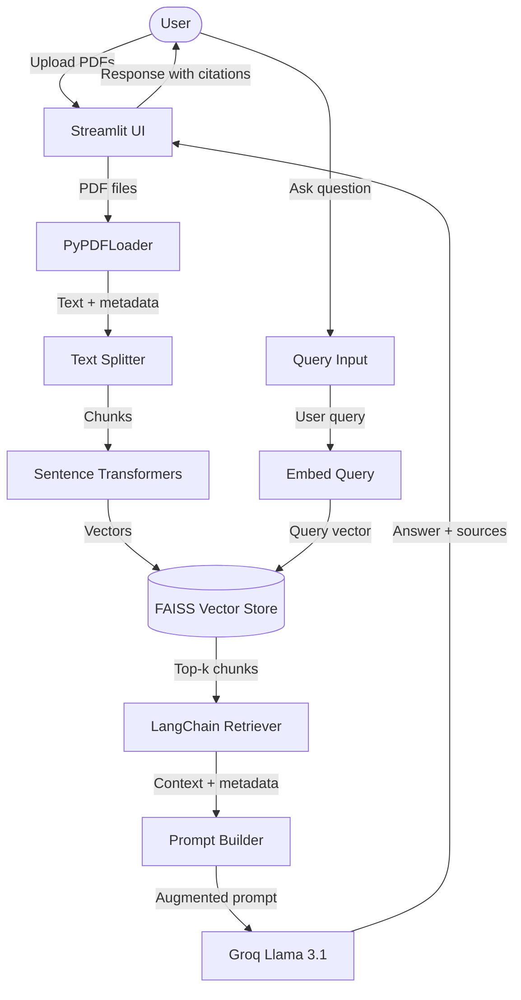
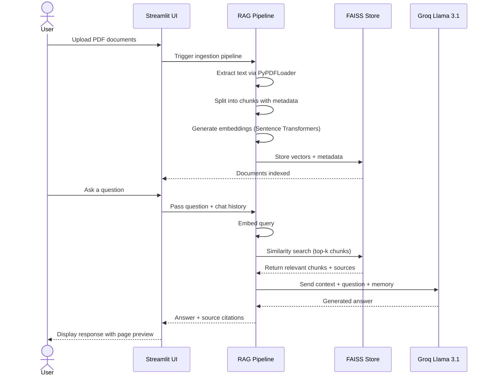

<div align="center">

# 🧠 AI PDF Knowledge Assistant

### *Chat with your documents. Get answers, not just search results.*

[](https://www.python.org/)
[](https://streamlit.io/)
[](https://langchain.com/)
[](https://faiss.ai/)
[](https://groq.com/)
[](LICENSE)

<br/>

> **AI PDF Knowledge Assistant** is a production-ready Retrieval-Augmented Generation (RAG) chatbot that lets you upload one or more PDF documents and ask natural-language questions. It retrieves the most relevant content from your documents and uses **Groq's Llama 3.1** to generate precise, grounded answers — complete with source citations down to the page number.

<br/>


</div>

---

## 📋 Table of Contents

- [✨ Features](#-features)
- [🏗️ System Architecture](#️-system-architecture)
- [🔄 Query Flow](#-query-flow)
- [🛠️ Tech Stack](#️-tech-stack)
- [⚡ Quick Start](#-quick-start)
- [🔑 Groq API Setup](#-groq-api-setup)
- [💬 Example Questions](#-example-questions)
- [📁 Project Structure](#-project-structure)
- [🧩 Design Decisions](#-design-decisions)
- [🚀 Future Improvements](#-future-improvements)
- [👤 Author](#-author)

---

## ✨ Features

| Feature | Description |
|---|---|
| 📂 **Multi-PDF Upload** | Upload and query across multiple PDF documents simultaneously |
| 🔍 **Semantic Search** | Sentence Transformer embeddings capture meaning, not just keywords |
| 🤖 **RAG Pipeline** | Context-aware answers grounded strictly in your documents |
| 📌 **Source Citations** | Every answer includes document name, page number, and section |
| 🗂️ **Metadata Filtering** | Narrow retrieval by specific document or page range |
| 💬 **Conversational Memory** | Multi-turn chat with full context retention across questions |
| 📄 **Page Preview** | Instantly preview the exact PDF page your answer came from |
| 💾 **Export Chat History** | Download your full conversation as a formatted PDF |

---

## 🏗️ System Architecture



---

## 🔄 Query Flow



---

## 🛠️ Tech Stack

| Layer | Technology | Purpose |
|---|---|---|
| **Frontend** | [Streamlit](https://streamlit.io/) | Interactive web UI for chat and PDF upload |
| **Orchestration** | [LangChain](https://langchain.com/) | RAG pipeline, memory, and chain management |
| **LLM** | [Groq — Llama 3.1](https://groq.com/) | Ultra-fast inference for answer generation |
| **Embeddings** | [Sentence Transformers](https://sbert.net/) | Semantic vector representations of text chunks |
| **Vector Store** | [FAISS](https://faiss.ai/) | High-speed approximate nearest-neighbor search |
| **PDF Parsing** | [PyPDFLoader](https://python.langchain.com/docs/modules/data_connection/document_loaders/pdf) | Text and metadata extraction from PDFs |
| **Language** | Python 3.10+ | Core application language |

---

## ⚡ Quick Start

### Prerequisites

- Python 3.10 or higher
- A free [Groq API key](https://console.groq.com/)
- `git` installed

### 1. Clone the Repository

```bash
git clone https://github.com/your-username/ai-pdf-knowledge-assistant.git
cd ai-pdf-knowledge-assistant
```

### 2. Create a Virtual Environment

```bash
python -m venv venv

# On macOS/Linux
source venv/bin/activate

# On Windows
venv\Scripts\activate
```

### 3. Install Dependencies

```bash
pip install -r requirements.txt
```

### 4. Configure Environment Variables

```bash
cp .env.example .env
```

Open `.env` and add your Groq API key (see [Groq API Setup](#-groq-api-setup) below).

### 5. Run the App

```bash
streamlit run app.py
```

The app will open at **`http://localhost:8501`** in your browser.

---

## 🔑 Groq API Setup

1. Visit [console.groq.com](https://console.groq.com/) and sign up for a free account.
2. Navigate to **API Keys** → **Create new API key**.
3. Copy the key and add it to your `.env` file:

```env
GROQ_API_KEY=your_groq_api_key_here
```

> ⚠️ **Never commit your `.env` file.** It is already included in `.gitignore`.

Groq provides a generous **free tier** with access to Llama 3.1 — no credit card required to get started.

---

## 💬 Example Questions

Once you've uploaded your PDF documents, try asking:

```
📘 Research Papers
"What methodology did the authors use in Section 3?"
"Summarize the key findings from the results section."
"What limitations did the paper acknowledge?"

📋 Legal / Policy Documents
"What are the termination clauses in this contract?"
"What are the data retention requirements mentioned?"

📚 Study Materials / Textbooks
"Explain the concept introduced on page 12."
"What are the differences between X and Y as described in Chapter 2?"

📊 Reports / Manuals
"What were the revenue figures for Q3?"
"How do I configure the device according to the setup guide?"
```

---

## 📁 Project Structure

```
ai-pdf-knowledge-assistant/
│
├── app.py                  # Streamlit frontend — UI, upload, chat interface
├── rag_pipeline.py         # RAG logic — ingestion, retrieval, LLM chain
├── requirements.txt        # Python dependencies
├── .env.example            # Environment variable template
├── .gitignore              # Git ignore rules
└── README.md               # Project documentation
```

### Key Files

**`app.py`** — Handles the Streamlit interface: PDF upload widget, chat message rendering, page preview, and chat export. Calls functions from `rag_pipeline.py`.

**`rag_pipeline.py`** — Contains the full RAG pipeline: PDF loading via `PyPDFLoader`, text chunking, embedding generation with Sentence Transformers, FAISS indexing, retriever setup, conversational memory, and the LangChain chain connected to Groq.

---

## 🧩 Design Decisions

### Why FAISS?
FAISS (Facebook AI Similarity Search) was chosen over managed vector databases (Pinecone, Weaviate) because it runs **fully locally** — no API keys, no rate limits, no cost. For a document-scoped use case where the vector store is rebuilt per session, FAISS's in-memory mode offers excellent performance with zero infrastructure overhead.

### Why Sentence Transformers?
Rather than using the LLM provider's embedding API, Sentence Transformers run **on-device** with models like `all-MiniLM-L6-v2`. This eliminates embedding API costs, reduces latency, and keeps document content private — critical for users uploading sensitive PDFs.

### Why Groq + Llama 3.1?
Groq's custom LPU hardware delivers **inference speeds 10–20× faster** than typical GPU-based API providers, making the chat feel genuinely real-time. Llama 3.1 is a state-of-the-art open-weight model that performs strongly on instruction-following and document comprehension tasks.

### Why LangChain?
LangChain's `ConversationalRetrievalChain` handles the complexity of multi-turn memory, prompt templating, and retriever integration in a clean abstraction. It significantly reduces boilerplate and makes the pipeline easy to extend.

### Why Streamlit?
Streamlit allows for rapid prototyping of data-heavy UIs entirely in Python — no frontend experience required. Its file uploader, chat components, and column layouts map naturally to this use case.

---

## 🚀 Future Improvements

- [ ] 🌐 **Web URL ingestion** — Scrape and index web pages alongside PDFs
- [ ] 🔐 **Authentication** — User login with per-user document namespaces
- [ ] ☁️ **Persistent vector store** — Save FAISS indexes to disk for multi-session use
- [ ] 📊 **Answer confidence scores** — Display retrieval relevance scores per source
- [ ] 🌍 **Multilingual support** — Embeddings and responses in non-English documents
- [ ] 🧪 **Evaluation harness** — RAGAS-based faithfulness and relevance scoring
- [ ] 🐳 **Docker deployment** — One-command containerized setup
- [ ] 🔄 **Streaming responses** — Token-by-token streaming for faster perceived response time

---

## 👤 Author

<div align="center">

**Your Name**

[](https://github.com/your-username)
[](https://linkedin.com/in/your-profile)
[](https://your-portfolio.com)

*Built with ❤️ and a passion for making AI practical and accessible.*

</div>

---

<div align="center">

**⭐ If you found this project useful, please consider giving it a star!**

*It helps others discover the project and motivates continued development.*

</div>